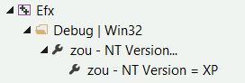
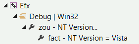

## Introduction

Actuellement, nos projets de base (**comptabilité**, **facturation** et **salaires**) partagent certaines fonctionnalités à l'aide de sous-modules *git*. Un tel partage de code fournit pas mal d'avantages mais aussi quelques inconvénients. En effet, la paramétrisation d'un projet de sous-module peut se répercuter sur tous les projets de base qui utilisent ce sous-module.  
Imaginons par exemple que les versions minimales de Windows supportées soient *XP* pour *salaires* et *Vista* pour *facturation*. Comment paramétriser les sous-modules partagés entre salaires et facturation pour supporter ces exigences?  
Une solution serait de créer plusieurs branches *git* dans chaque sous-module, une pour *salaires* et une pour *facturation* avec un paramétrage différent des projets dans chaque branche. L'inconvénient principal de cette méthode est qu'il faut maintenir plusieurs versions des projets de *build* dans chaque branche de chaque sous-module partagé, et cela pourrait vite se transformer en cauchemar...

**Zou** a été créer pour essayer de résoudre ce genre de problèmes. Il réunit différents ***z*****ou**tils de gestion et de paramétrisation:

- il permet de centraliser certains paramètres et outils de *build*.
- il permet d'unifier, de normaliser et surtout d'instancier la paramétrisation des projets partagés.
- il suggère une certaine organisation des différents composants. 

## Le modèle logique ou la trinité *zou*

Les principaux acteurs pris en considération par *zou*, dans un ordre hiérarchique, sont le ***bundle***, la **solution** et le **projet**.  
Le *bundle* peut contenir plusieurs solutions qui chacune peut contenir plusieurs projets.  

### 1. ***Bundle***
Le *bundle* représente un arbre de développement (***bundle tree***) en tant qu'il est distinct d'autres *bundles*.  
Chaque **sous-arbre** du *bundle* (***bundle subtree***) peut être:

- soit **partagé** avec d'autres *bundles* (sous-modules *git*).
- soit **local** au *bundle* (non partagé).

Les sous-dossiers contenant une *solution* et/ou un *projet* sont des **noeuds** logiques du *bundle* (***bundle node***).  
Chaque noeud logique appartient à un sous-arbre et partage donc ses attributs (partagé ou local).

> Il est préférable de ne pas créer de fichiers dans la racine du bundle à part peut-être les fichiers communs de configuration *git*.

### 2. ***Solution***
La *solution* associe et combine les configurations et plateformes de plusieurs *projets*. *Visual Studio* nous en donne une bonne représentation avec son `Solution Explorer` et son `Configuration Manager`. 
  
Le dossier de la solution peut être utilisé comme base pour mettre en commun les résultats de certains projets:

- les paquets *nuget* sont stockés dans le sous-dossier `packages`.
- la sortie des projets C++ peut être définie comme un sous-dossier de la solution (`Win32\vc140\Debug` par exemple). Cela permet de réunir les dépendences natives et d'obtenir un **dossier exécutable** .

> - le format d'une solution est un peu particulier, dans le sens qu'il est différent du [format *MSBuild*](https://msdn.microsoft.com/en-us/library/5dy88c2e.aspx).
> - la [tâche *MSBuild*](https://msdn.microsoft.com/en-us/library/z7f65y0d.aspx) ne sait pas gérer l'ordre de *build* des projets d'une solution. Seul `msbuild.exe` et *Visual Studio* le savent.

### 3. ***Project***
Le projet est l'unité de base de *MSBuild*. C'est lui qui définit les paramètres et les tâches à accomplir.

## Schéma logique
Dans l'exemple ci-dessous, les projets `S1` et `S2` sont **partagés**. Les autres solutions et projets sont **locaux**.

				Bundle[1]                       Bundle[2]
				|                               |
				|--Solution[L11]                |--Solution[L21]
				|  |--Projet[L11]               |  |--Projet[L21]
				|  |.........> Projet[S1] <.....:..|
				|  :                            |
				|                               |
				|--Solution[L12]                |--Solution[L22]
				   |--Projet[L12]                  |--Projet[L22]
				   |.........> Projet[S2] <........|
				   :

## Paramétrisation virtuelle des projets

La paramétrisation *zou* des projets est basée sur les [feuilles de propriétés](https://msdn.microsoft.com/en-us/library/669zx6zc.aspx) de *MSBuild*.

> ### Importation d'une feuille de propriétés dans un projet C++
> 
> On peut importer une feuille de propriétés dans un projet C++ directement depuis Visual Studio en utilisant le gestionnaire de propriétés:
>  
> - ouvrir le gestionnaire de propriétés: *View/Other Windows/Property Manager*.
> - dans le menu contextuel du projet ou de l'une de ses configurations cliquer *Add existing property sheet...*.
> - choisir un fichier *.props* et le tour est joué.

### Principe
Le principe de base est de toujours importer des feuilles de propriétés **génériques** fournies par *zou* ([zou/Cpp.NTVersion.props](Cpp.NTVersion.props), [zou/Cpp.OutDir.props](Cpp.OutDir.props), ...). Ce lien d'importation est stocké dans le projet et n'est plus censé changer sauf rares exceptions.  
Mais comment peut-on paramétriser différemment des projets *partagés* selon qu'ils son enfants d'un bundle ou d'un autre?

En fait, certaines feuilles de propriétés *intelligentes* implémentent un mécanisme de ***fallback*** sur des **feuilles de propriétés enfants** stockées dans des dossiers bien spécifiques définis par *zou*. Ces dossiers de *fallback* sont soit locaux, soit partagés et sont définis en fonction du **champ d'application désiré des feuilles de propriétés**, du plus spécifique au plus large. Si aucune feuille de propriétés enfant n'est définie, une **feuille de propriétés par défaut** est fournie par *zou* ([zou/Cpp.NTVersion.Default.props](Cpp.NTVersion.Default.props), [zou/Cpp.OutDir.Default.props](Cpp.OutDir.Default.props), ...).

### Exemple
Reprenons l'exemple de salaires sous *XP* et de facturation sous *Vista* cité dans l'introduction. Pour résoudre le problème de la paramétrisation des versions de *NT* avec *zou*,  on va:

1. Importer (à l'aide du gestionnaire de propriétés de *Visual Studio*) la feuille de propriétés *intelligente* `zou\Cpp.NTVersion.props` dans tous les projets contenus dans facturation et salaires. C'est cette feuille de propriétés qui implémente le *fallback*.
2. Etant donné que la version de *NT* par défaut définie par *zou* est *XP*, il suffit de remplacer cette valeur par *Vista* dans le `bundle` *facturation*. Pour ce faire, on va:  
	- créer un sous-dossier `zou.cfg` dans la racine du `bundle` *facturation*.
	- copier la feuille de propriétés `zou/Templates/props/Cpp.NTVersion.props` dans le dossier `zou.cfg` que l'on vient de créer.
	- éditer et modifier si nécessaire la valeur de `NTVersion` comme ceci:  `<NTVersion>0x0600</NTVersion>`

###### Code d'importation d'une feuille de propriétés insérée par le gestionnaire de propriétés dans un projet *C++*. 

	  	...
	  	<ImportGroup Label="PropertySheets" >
	    	<Import Project="..\zou\Cpp.NTVersion.props" />
	  	</ImportGroup>
		...

###### Surcharge de la version NT dans le bundle facturation (`fact/zou.cfg/Cpp.NTVersion.props`).

		<?xml version="1.0" encoding="utf-8"?>
		<Project ToolsVersion="4.0" xmlns="http://schemas.microsoft.com/developer/msbuild/2003">
		  <PropertyGroup>
		    <_PropertySheetDisplayName>fact - NT Version = Vista</_PropertySheetDisplayName>
		  </PropertyGroup>
		  
		  <PropertyGroup Condition="'$(NTVersion)' == ''">
		    <NTVersion>0x0600</NTVersion>
		  </PropertyGroup>
		</Project>

Et voici ce que ça donne dans le gestionnaire de propriétés de *Visual Studio* pour le sous-module `libefx`:

1. Dans *salaires*:    
  
  
1. Dans *facturation*:  

> ###Observations:
> 
> - Dans les deux cas, la première feuille de propriétés - **zou - NT Version...** - est la feuille générique fournie par *zou* qui implémente le *fallback*: `zou/Cpp.NTVersion.props`.
> - Pour *salaires*, la feuille enfant - **zou - NT Version = XP** -  est celle par défaut fournie par *zou*: `zou/Cpp.NTVersion.Default.props`.
> - Pour *facturation*, la feuille enfant - **fact - NT Version = Vista** -   est celle que l'on a surchargé localement dans `fact/zou.cfg/Cpp.NTVersion.props`.
