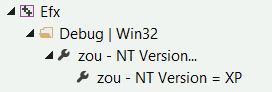
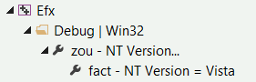

# [<](virtual-property-sheets)&emsp;&emsp;[>](property-sheet-shared-overload)

# Surcharge d'une feuille de propriétés

Reprenons l'exemple de *salaires* sous *XP* et de *facturation* sous *Vista*
cité dans l'[introduction](0_Introduction.md). Le problème revient à paramétrer différemment la macro
*C++* `_WIN32_WINNT` en fonction du *bundle* choisi:

- `_WIN32_WINNT=0x501` pour *salaires*.
- `_WIN32_WINNT=0x600` pour *facturation*.

Les étapes sont les suivantes:

1. Importer (à l'aide du gestionnaire de propriétés de *Visual Studio*) la
feuille de propriétés virtuelle [zou/Cpp.NTVersion.props](../Cpp.NTVersion.props)
dans tous les projets des *bundles* facturation et salaires.
2. Etant donné que la version de *NT* par défaut définie par *zou* vaut *XP* et que la version NT de *salaires* coïncide avec ce défaut, il suffit de surcharger le `bundle` *facturation*:  
	- créer un sous-dossier `zou.cfg` dans la racine du `bundle` *facturation*.
	- copier la feuille de propriétés
	[zou/Cpp.NTVersion.Default.props](../Cpp.NTVersion.Default.props) dans le
	dossier `zou.cfg` que l'on vient de créer et la renommer en
	`Cpp.NTVersion.props`.
	- éditer et modifier la valeur de `NTVersion` pour *Vista*, c.à.d. `0x0600`

```
		<?xml version="1.0" encoding="utf-8"?>
		<Project ToolsVersion="4.0" xmlns="http://schemas.microsoft.com/developer/msbuild/2003">
		  <PropertyGroup>
		    <_PropertySheetDisplayName>fact - NT Version = Vista</_PropertySheetDisplayName>
		  </PropertyGroup>	  
		  <PropertyGroup Condition="'$(NTVersion)' == ''">
		    <NTVersion>0x0600</NTVersion>
		  </PropertyGroup>
		</Project>
```

Et voici ce que ça donne dans le gestionnaire de propriétés de *Visual Studio*
pour le sous-module [libefx](https://git.epsitec.ch/cresus-suite/libefx):

1. Dans *salaires* (pas de surcharge):    
  
  
1. Dans *facturation* (surcharge Vista):  


> Par convention, le titre d'une feuille de propriétés *virtuelle* se
> termine par `...`. 

### Résumé

- Dans les deux cas, la première feuille de propriétés (**zou - NT Version...**)
est la feuille générique fournie par *zou* qui implémente le *fallback*:
[zou/Cpp.NTVersion.props](../Cpp.NTVersion.props).  
- Pour *salaires*, la feuille enfant (**zou - NT Version = XP**)  est le défaut
fourni par *zou* ([zou/Cpp.NTVersion.Default.props](../Cpp.NTVersion.Default.props)).
- Pour *facturation*, la feuille enfant (**fact - NT Version = Vista**)
est la surcharge stockée *localement* dans
[fact/zou.cfg/Cpp.NTVersion.props](https://git.epsitec.ch/cresus-suite/fact/blob/master/zou.cfg/Cpp.NTVersion.props).

---
# [<](virtual-property-sheets)&emsp;&emsp;[>](property-sheet-shared-overload)
